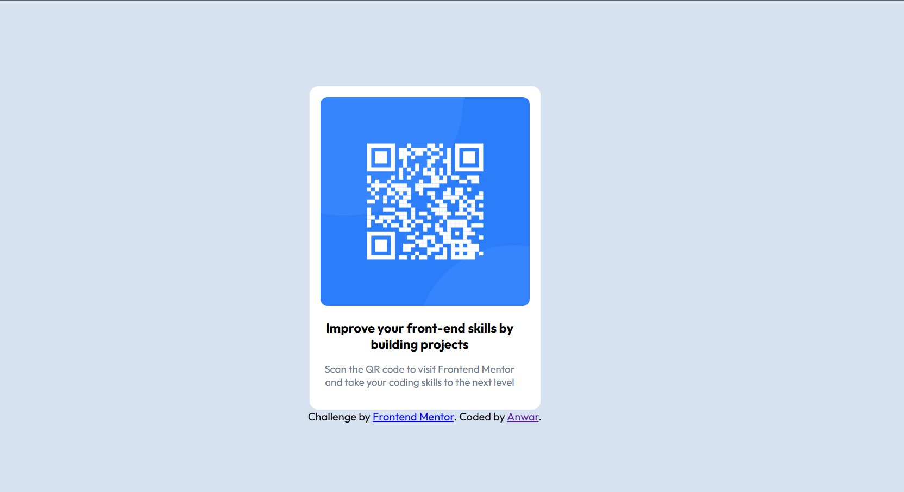
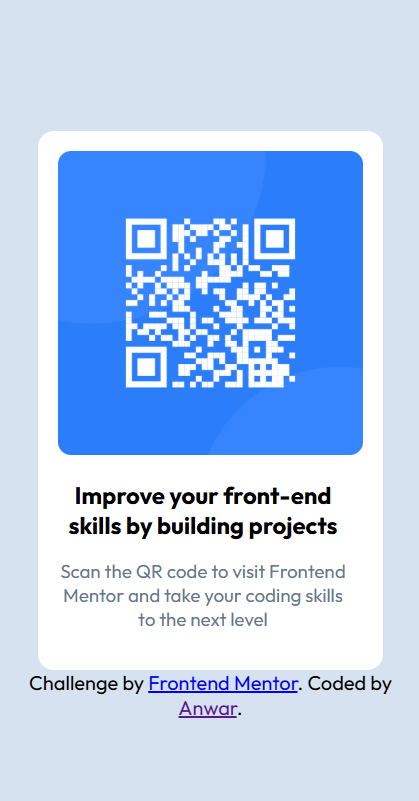

# Frontend Mentor - QR code component solution

This is a solution to the [QR code component challenge on Frontend Mentor](https://www.frontendmentor.io/challenges/qr-code-component-iux_sIO_H). Frontend Mentor challenges help you improve your coding skills by building realistic projects. 

## Table of contents

- [Overview](#overview)
  - [Screenshot](#screenshot)
  - [Links](#links)
- [My process](#my-process)
  - [Built with](#built-with)
  - [What I learned](#what-i-learned)
- [Author](#author)

**Note: Delete this note and update the table of contents based on what sections you keep.**

## Overview

### Screenshot





### Links

- Solution URL: [Add solution URL here](https://your-solution-url.com)
- Live Site URL: [Add live site URL here](https://your-live-site-url.com)

## My process

### Built with

- Semantic HTML5 markup
- CSS custom properties
- Flexbox
- Mobile-first workflow
- [Styled Components](https://styled-components.com/) - For styles


### What I learned

I've learned how i could work with flex-box and how i could allign items with css.


```html
  <div class="box__container container">
    <div class="qr__code--container">
      
    </div>
    <div class="box__content">
      <h2 class="box__title">Improve your front-end skills by building projects</h2>
      <p class="box__p">Scan the QR code to visit Frontend Mentor and take your coding skills to the next level</p>
    </div>
  </div>
  <div class="attribution">
    Challenge by <a href="https://www.frontendmentor.io?ref=challenge" target="_blank">Frontend Mentor</a>. 
    Coded by <a href="#">Anwar</a>.
  </div>
```
```css
    @import url('https://fonts.googleapis.com/css2?family=Outfit:wght@100..900&display=swap');
    *,*::before,*::after {
      box-sizing: border-box;
    }
    html {
      height: 100%;
      align-items: center;
      display: flex;
      text-align: center;
    }
    body {
      background-color: hsl(212, 45%, 89%);
      font-family: "Outfit", sans-serif;
    }
    .box__container {
      width: 85%;
      margin: 0 auto;
      background-color: hsl(0, 0%, 100%);
      padding: 1em;
      border-radius: .8em;
      text-align: center;
      align-items: center;
    }
    img {
      max-width: 100%;
      border-radius: .65em;
    }
    .box__content {
      width: 95%;
    }
    .box__p {
      font-size: 15px;
      color: hsl(216, 15%, 48%);
    }
    .box__title {
      font-size: 19px;
    }
    @media (min-width: 400px) {
      .container {
        max-width: 400px;
      }
      html {
        justify-content: center;
      }
    }
    .attribution {
      position: fixed;
      bottom: 0;
      left: 0;
      right: 0;
    }
```
```js

```

## Author

- Website - [EL OUARDINI Anwar](https://www.your-site.com)
- Frontend Mentor - [@awr-png](https://www.frontendmentor.io/profile/awr-png)
